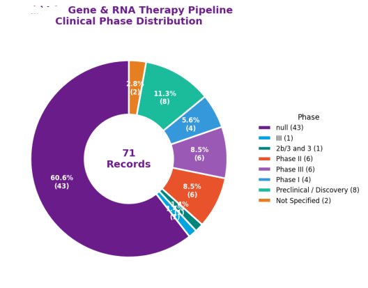
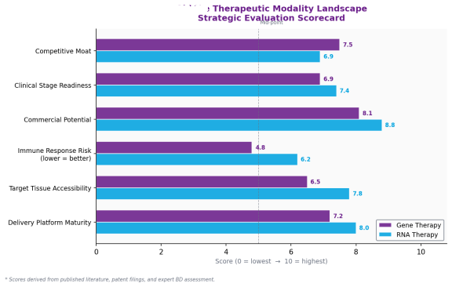

# Gene & RNA Therapeutics Intelligence Pipeline
Leverage AI and Literature For Insights 

## Project Overview
AI‑powered PubMed for BD, R&D, and Competitive Strategy
This project builds an end‑to‑end intelligence pipeline that automatically retrieves, structures, analyzes, and visualizes scientific and patent evidence for gene therapy and RNA therapeutics. It is designed to support BD&L, competitive intelligence, R&D strategy, and due diligence workflows in pharma and biotech.
The system integrates PubMed,LLM‑based structured extraction, evidence summaries, competitive landscape analysis, and BD‑ready Word report generation—all in one automated workflow.

## Dataset
Pubmed

## Key Capabilities
1. Automated Literature:
- Queries PubMed using NCBI Entrez
- Supports configurable company, modality, and disease focus
- Extracts abstracts and metadata for downstream analysis

2. LLM‑Powered Structured Evidence Extraction
Strict JSON extraction (sample size, study design, phase, endpoints, efficacy, safety):
- Includes source sentences for auditability
- Validates completeness before downstream use

3. LLM Summaries & Competitive Intelligence
Generates 3–4 sentence evidence summaries:
- Produces competitive landscape analysis
- Key competitors
- MoA comparisons
- Efficacy & safety positioning
- Strategic threat level

4. Visual Intelligence (Charts)
Two branded charts are automatically generated:
- Clinical Phase Distribution (Donut Chart)
- Gene vs RNA Therapy Strategic Scorecard (Horizontal Bar Chart)

5. BD‑Ready Word Report Generation
Automatically produces a polished .docx report containing:
- Title page with metadata
- Visual intelligence charts
- Structured evidence tables
- LLM summaries
- Competitive analysis
- Exported to outputs/<drug_name>_BD_READY_REPORT.docx

## Example Use Case
The included configuration demonstrates how the pipeline can answer strategic questions for gene & RNA therapeutics portfolio:
- What scientific and patent evidence exists for AbbVie’s gene/RNA programs?
- What is the clinical phase distribution across modalities?
- How do gene therapy and RNA therapy compare across BD‑critical metrics?
- What are the key competitors and their MoA?
- What are the safety/efficacy signals across studies?
- Where are the white‑space opportunities?

## Project Structure

├── main.py                     # Main pipeline entry point
├── outputs/                    # Auto-generated charts, CSVs, and Word reports
├── requirements.txt            # Python dependencies
└── README.md                   # Project documentation

## Methodology
- Step 1 — Configure the drug/company focus
- Step 2 — Retrieve PubMed & Patent Data
- Step 3 — Extract Structured Evidence
- Step 4 — Summaries & Competitive Analysis
- Step 5 — Visual Intelligence
- Step 6 — Export BD‑Ready Report

## Tech Stack
Python

## Example Outputs
1. Clinical Phase Distribution (Donut Chart)
Shows aggregated development stage distribution across extracted records + supplemental pipeline data.

2. Therapeutic Modality Scorecard
Compares gene therapy vs RNA therapy across:
Delivery maturity
Tissue accessibility
Immune risk
Commercial potential
Clinical readiness
Competitive moat

3. BD‑Ready Word Report

## Tech Stack
NCBI Entrez API
Groq + Llama 3.1
Data processing
Python
Pandas
Matplotlib
export	python-docx

## Running the Pipeline
1. Install dependencies
pip install -r requirements.txt

2. Set environment variables
NCBI_EMAIL=your_email
NCBI_API_KEY=your_ncbi_key
GROQ_API_KEY=your_groq_key
LENS_API_KEY=your_lens_key

3. Run
python main.py

4. Find outputs
All generated files will appear in: outputs/
